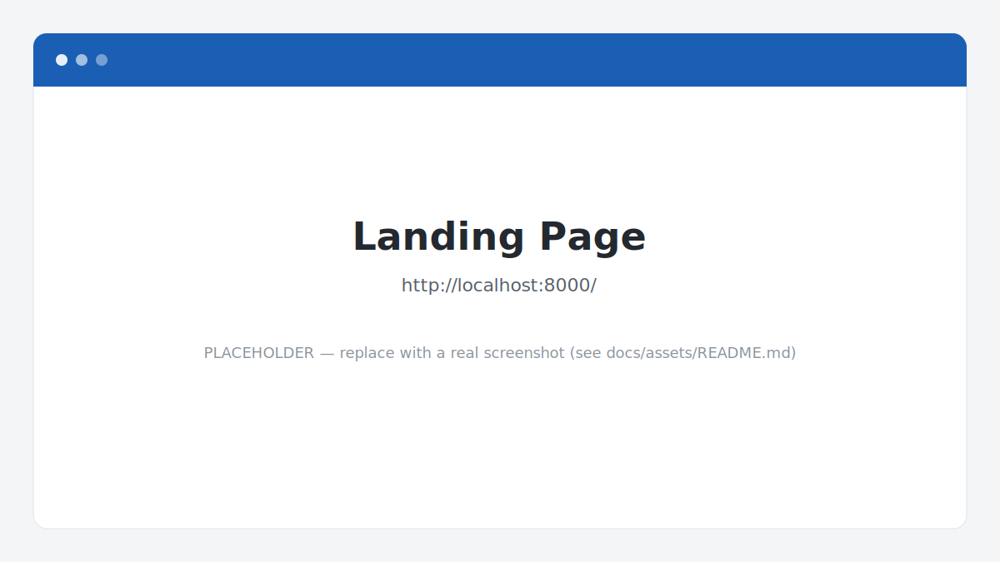
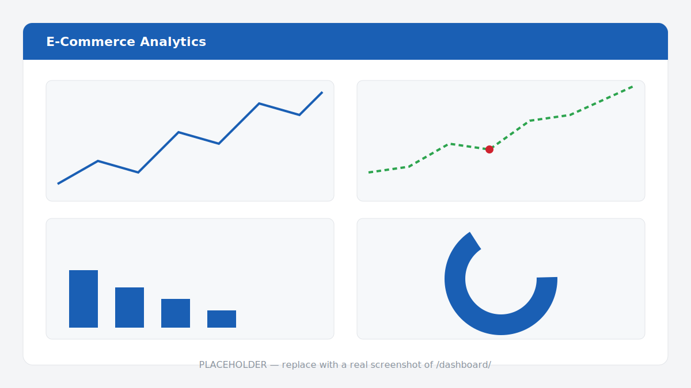
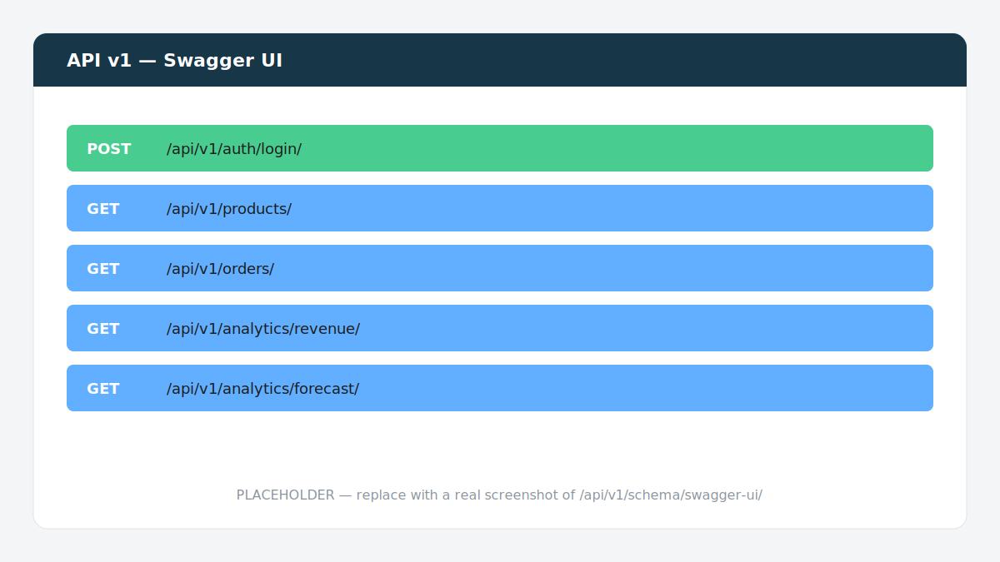
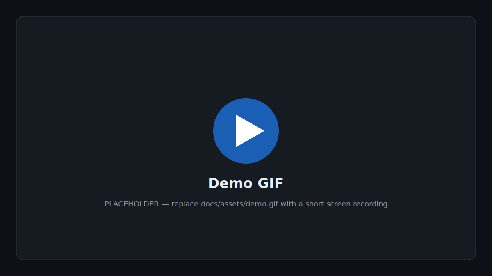

<div align="center">

# E-Commerce Analytics Dashboard

**A Django/DRF platform that turns raw multi-currency orders into revenue KPIs, customer insights, and sales forecasts — served through a REST API and a server-rendered Plotly dashboard.**

[](https://github.com/elsayed07/ecommerce_analytics/actions/workflows/ci.yml)


</div>

---

## Overview

E-Commerce Analytics Dashboard is a backend-focused portfolio project that models a real
analytics workflow end to end:

1. **Ingest** order data (CSV/JSON) through a validated, idempotent ETL pipeline.
2. **Normalise** multi-currency amounts to EUR and quarantine bad rows instead of dropping them.
3. **Precompute** revenue, customer, and product KPIs into `AnalyticsSnapshot` rows via
   scheduled Celery jobs (analytics are never computed live on the request path).
4. **Forecast** future revenue with a linear-regression trend and flag anomalies with z-scores.
5. **Serve** everything through a versioned REST API (with OpenAPI docs) and a Plotly dashboard.

The codebase follows a strict **service-layer architecture**: all business logic lives in
`services/`, views stay thin, and models stay dumb.

> **Status:** feature-complete across all five build phases (foundation → API → ETL →
> analytics → forecasting). Verified locally via Docker with **103 tests** and **~96%**
> coverage. Not yet deployed to a public host — see [Deployment](#deployment).

## Live demo

> 🔗 **Live demo:** _Not currently deployed. The whole stack runs locally with a single
> `docker compose up` — see [Getting started](#getting-started)._ &nbsp;_(placeholder)_

## Screenshots

> The images below are **placeholders**. See
> [`docs/assets/README.md`](docs/assets/README.md) for how to capture and drop in the real
> screenshots.

| Landing page | Analytics dashboard |
|---|---|
|  |  |

| API docs (Swagger) |
|---|
|  |

## Demo

> Placeholder — replace `docs/assets/demo.gif` with a short walkthrough recording
> (login → dashboard → an API call in Swagger).



## Features

**API & auth**
- Versioned REST API under `/api/v1/` with a standardised response envelope
  (`{"success": true, "data": ...}` / structured error codes).
- JWT authentication (access + refresh) via SimpleJWT, with three roles —
  `admin`, `analyst`, `staff` — enforced by reusable DRF permission classes.
- Every list endpoint supports pagination, filtering, search, and ordering.
- Auto-generated OpenAPI docs (Swagger UI + ReDoc) via drf-spectacular.
- `/health/` endpoint reporting database, Redis, and Celery status.

**ETL pipeline**
- CSV/JSON ingestion that is **idempotent and incremental** (safe to re-run the same file).
- Data-quality validation: missing fields, invalid/future dates, negative price/quantity,
  duplicate lines, malformed SKUs, unsupported currencies, inconsistent order headers.
- Invalid rows are routed to an `ErrorQuarantine` table with a reason — never silently dropped.
- Multi-currency amounts normalised to EUR on import.
- Soft-delete-consistent upserts (re-imports restore/clean rows rather than duplicating).
- Triggered on demand (management command / API) or nightly via Celery Beat.

**Analytics & forecasting**
- Revenue (daily / weekly / monthly) with growth %, AOV, and rolling 7- & 30-day averages.
- Top products by revenue and by quantity; customer breakdown (new vs. returning, average LTV).
- KPIs precomputed into `AnalyticsSnapshot` (the source of truth) and cached in Redis;
  the cache is invalidated automatically when snapshots rebuild.
- 30-day revenue projection via scikit-learn linear regression (calendar-gap-filled).
- Z-score anomaly detection on daily revenue.
- Server-rendered Plotly dashboard (responsive layout) visualising all of the above.

**Tooling & quality**
- Fully Dockerised (web, Postgres, Redis, Celery worker, Celery beat).
- Deterministic, seasonal **demo-data generator** for screenshots and interviews.
- GitHub Actions CI running Ruff + pytest on every push/PR.
- Soft deletion and audit timestamps (`created_at` / `updated_at`) on all core models.

## Tech stack

| Layer | Technology |
|---|---|
| Language | Python 3.12 |
| Web / API | Django 5, Django REST Framework, SimpleJWT, django-filter |
| API docs | drf-spectacular (Swagger + ReDoc) |
| Database | PostgreSQL 16 |
| Cache / broker | Redis 7 |
| Task queue | Celery 5 + Celery Beat |
| Data / ML | scikit-learn, NumPy |
| Visualisation | Plotly (server-rendered into Django templates) |
| Config | django-environ (12-factor `.env`) |
| Tooling | Docker / docker-compose, Ruff, pytest, factory_boy, coverage |
| CI | GitHub Actions |
| Serving (prod) | Gunicorn |

## Architecture

```
Request ─▶ View (thin)  ─▶  Service (business logic)  ─▶  Model (data only)
                                  │
ETL files ─▶ import_service ──────┤
Celery Beat ─▶ tasks/ ────────────┤──▶  AnalyticsSnapshot  ──▶  Redis cache  ──▶  API / Dashboard
                                  │
analytics_service / forecasting_service
```

- **Views** validate transport and delegate — no business logic.
- **Services** (`services/`) own all logic, transactions, and aggregation. They never touch
  `request`/`Response` objects, so they're unit-testable in isolation.
- **Models** are plain data containers with soft delete + timestamps.

## Folder structure

```
ecommerce_analytics/
├── apps/
│   ├── common/        # BaseModel (timestamps + soft delete), permissions, renderers,
│   │                  #   error middleware, health + landing views, generate_demo_data
│   ├── users/         # Custom User model (roles) + JWT auth routes
│   ├── products/      # Category, Product, Inventory + viewsets
│   ├── orders/        # Customer, Order, OrderItem + viewsets
│   ├── ingestion/     # ImportJob, ErrorQuarantine + import_orders command
│   └── analytics/     # AnalyticsSnapshot, analytics API, Plotly dashboard, build_snapshots
├── services/          # Business logic: import, revenue, analytics, forecasting, demo_data
├── tasks/             # Celery tasks: nightly_import, analytics_snapshot
├── config/            # Settings (base/development/production), urls, celery, wsgi
├── tests/             # pytest suite + factory_boy factories
├── data/
│   ├── sample/        # Sample ETL files (valid/invalid orders, products)
│   └── inbox/         # Drop folder for scheduled imports
├── docs/assets/       # Screenshots & demo assets
├── requirements/      # base / development / production
├── Dockerfile
├── docker-compose.yml
└── pyproject.toml     # Ruff + pytest config
```

## API overview

All endpoints are under `/api/v1/` and (except auth) require a Bearer token.

| Resource | Endpoint | Notes |
|---|---|---|
| Auth | `POST /api/v1/auth/login/`, `POST /api/v1/auth/refresh/` | Obtain / refresh JWT |
| Products | `GET/POST /api/v1/products/`, `…/{id}/` | Filter, search, order |
| Categories | `GET/POST /api/v1/categories/` | |
| Orders | `GET /api/v1/orders/`, `…/{id}/` | Read-only, filterable by status/customer/currency |
| Customers | `GET /api/v1/customers/`, `…/{id}/` | Read-only |
| Imports | `GET/POST /api/v1/imports/` | Upload & track ETL jobs |
| Analytics | `GET /api/v1/analytics/revenue/?period=daily\|weekly\|monthly` | From snapshots |
| Analytics | `GET /api/v1/analytics/top-products/` | |
| Analytics | `GET /api/v1/analytics/customers/` | |
| Analytics | `GET /api/v1/analytics/forecast/` | Projection + anomalies |
| Docs | `GET /api/v1/schema/swagger-ui/`, `…/redoc/` | Interactive API docs |
| Ops | `GET /health/` · `GET /dashboard/` · `/admin/` | |

<details>
<summary>Example: authenticate and call an endpoint</summary>

```bash
# 1. Get a token
TOKEN=$(curl -s -X POST http://localhost:8000/api/v1/auth/login/ \
  -H "Content-Type: application/json" \
  -d '{"username":"admin","password":"yourpassword"}' | python -c "import sys,json;print(json.load(sys.stdin)['data']['access'])")

# 2. Call the forecast endpoint
curl -s http://localhost:8000/api/v1/analytics/forecast/ \
  -H "Authorization: Bearer $TOKEN"
```
</details>

## Getting started

**Prerequisites:** Docker and Docker Compose.

```bash
git clone https://github.com/elsayed07/ecommerce_analytics.git
cd ecommerce_analytics

cp .env.example .env          # then set SECRET_KEY (and any overrides)
docker compose up --build -d  # web, postgres, redis, celery worker + beat
docker compose exec web python manage.py migrate
docker compose exec web python manage.py createsuperuser
```

The app is now at **http://localhost:8000** (landing page) · admin at `/admin/`.

### Seed demo data

Generate a realistic, reproducible dataset and precompute the analytics the dashboard reads:

```bash
docker compose exec web python manage.py generate_demo_data --orders=2000 --seed=42
docker compose exec web python manage.py build_snapshots
```

Then open **http://localhost:8000/dashboard/** (requires a staff login).

## Environment variables

Configuration is read from `.env` (see [`.env.example`](.env.example)).

| Variable | Description | Default |
|---|---|---|
| `SECRET_KEY` | Django secret key | _required_ |
| `DEBUG` | Debug mode | `False` |
| `ALLOWED_HOSTS` | Comma-separated hosts | _empty_ |
| `DJANGO_SETTINGS_MODULE` | `config.settings.development` / `.production` | development |
| `POSTGRES_DB/USER/PASSWORD/HOST/PORT` | Database connection | see `.env.example` |
| `REDIS_URL` | Redis connection (cache + Celery) | `redis://redis:6379/0` |
| `IMPORT_INBOX_DIR` | Folder scanned by the scheduled import | `/app/data/inbox` |
| `FORECAST_HORIZON_DAYS` | Days projected ahead | `30` |
| `ANOMALY_Z_THRESHOLD` | Z-score cutoff for daily-revenue anomalies | `3.0` |
| `GITHUB_REPO_URL` | Optional link shown on the landing page | _empty_ |

## Available commands

| Command | Purpose |
|---|---|
| `python manage.py generate_demo_data --orders=N --seed=S` | Generate synthetic demo data |
| `python manage.py build_snapshots` | Recompute analytics snapshots |
| `python manage.py import_orders --file=path.csv` | Run a file through the ETL pipeline |
| `python manage.py migrate` / `createsuperuser` | Standard Django management |
| `ruff check .` / `ruff format .` | Lint / format |
| `pytest --cov=. --cov-report=term-missing` | Run tests with coverage |

Prefix with `docker compose exec web` to run inside the container.

## Testing

```bash
docker compose exec web ruff check .
docker compose exec web python manage.py makemigrations --check --dry-run
docker compose exec web pytest --cov=. --cov-report=term-missing
```

The suite (pytest + factory_boy) covers services, API endpoints, the ETL pipeline,
analytics/forecasting, auth, permissions, and soft-delete semantics — **103 tests, ~96%
coverage** at last run. CI runs Ruff + pytest on every push and pull request.

## Deployment

The project targets a **single-server Docker Compose** deployment (e.g. Railway or Render
free tier) — no Kubernetes or horizontal scaling.

- Use `DJANGO_SETTINGS_MODULE=config.settings.production` and set a strong `SECRET_KEY`,
  real `ALLOWED_HOSTS`, and managed Postgres/Redis URLs via environment variables.
- The web image serves via **Gunicorn** in production (`requirements/production.txt`).
- Run `migrate` and `collectstatic` on release; run the Celery worker and beat as
  separate processes.

> A public deployment is not live yet; the steps above describe the intended target.

## Roadmap

Possible next steps (not yet implemented):

- [ ] Deploy a public demo instance and add the live link + real screenshots/GIF.
- [ ] Coverage reporting badge (Codecov) and a dedicated `ruff format --check` CI step.
- [ ] Product catalog importer (the ETL currently ingests order lines only).
- [ ] Richer dashboard filters (date range, per-category breakdowns).
- [ ] Export endpoints (CSV/Excel) for computed KPIs.

## Contributing

Contributions and suggestions are welcome — see [CONTRIBUTING.md](CONTRIBUTING.md) for the
workflow, coding conventions, and the checks to run before opening a PR.

## License

Released under the [MIT License](LICENSE).

## Author

**Sayed** — backend / data engineering portfolio project (domain inspired by
[Lilymade.it](https://lilymade.it), handmade crochet bags).

- GitHub: [@elsayed07](https://github.com/elsayed07)
- Email: elsayedelsayad41@gmail.com
